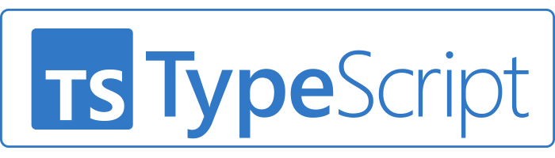

<br><br><br><br><br><br><br><br><br>

<h4>About TypeScript</h4>
<p>
I use npm for package management, but compared to Python, I feel that there are fewer general-purpose libraries like NumPy and Pandas. On the other hand, compared to C, TypeScript supports type inference, and I find it convenient that I can use let to flexibly store any type of value.　When comparing TypeScript to Java and Python, I noticed that handling classes follows a similar process , ①declaring variables, ②assigning values, and ③defining functions　(The following code is the example code building class in Java, Python, and TypeScript respectively). As for compilation, TypeScript first transpiles to JavaScript and then undergoes JIT compilation. While this approach differs from other languages I’ve used, I don’t find it particularly advantageous or disadvantageous. Overall, TypeScript makes programs easy to understand, but I feel it might have some limitations in terms of broad applicability and high-performance execution.
</p>

<h5>Calculator Class in Java</h5>

```cpp
class Calculator {
    private double num1;
    private double num2;

    public Calculator(double num1, double num2) {
        this.num1 = num1;
        this.num2 = num2;
    }

    public double add() {
        return num1 + num2;
    }

    public double subtract() {
        return num1 - num2;
    }

    public double multiply() {
        return num1 * num2;
    }

    public double divide() {
        if (num2 == 0) {
            throw new ArithmeticException("Cannot divide by zero.");
        }
        return num1 / num2;
    }
}
```

<h5>Calculator Class in Python</h5>

```cpp
class Calculator:
    def __init__(self, num1: float, num2: float):
        self.num1 = num1
        self.num2 = num2

    def add(self) -> float:
        return self.num1 + self.num2

    def subtract(self) -> float:
        return self.num1 - self.num2

    def multiply(self) -> float:
        return self.num1 * self.num2

    def divide(self) -> float:
        if self.num2 == 0:
            raise ZeroDivisionError("Cannot divide by zero.")
        return self.num1 / self.num2
```

<h5>Calculator Class in TypeScript</h5>

```cpp
class Calculator {
    private num1: number;
    private num2: number;

    constructor(num1: number, num2: number) {
        this.num1 = num1;
        this.num2 = num2;
    }

    add(): number {
        return this.num1 + this.num2;
    }

    subtract(): number {
        return this.num1 - this.num2;
    }

    multiply(): number {
        return this.num1 * this.num2;
    }

    divide(): number {
        if (this.num2 === 0) {
            throw new Error("Cannot divide by zero.");
        }
        return this.num1 / this.num2;
    }
}
```
<h4>About Athletic Software Engineering</h4>
<p>
After trying WODs (Workout of the Day), I found them enjoyable because they allow me to write code actively and gain hands-on programming experience. Other study methods, such as reading theory-heavy materials or working on complex programs, exist, but I think breaking tasks into smaller steps provides a better sense of achievement and makes learning more accessible for beginners. However, as one progresses toward becoming a developer, writing more complex code becomes necessary. At that stage, understanding theoretical concepts through reading and working on advanced code structures will also be important. At my current level as a TypeScript beginner, I find this learning method extremely effective.
</p>
