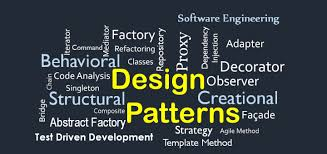

<br><br><br><br><br><br><br><br>

<h4>Introduction</h4>
<p>
Is there a programmer who develops every part of a program entirely from scratch? Aside from a handful of true pioneers, it is undeniable that most developers, to varying degrees, draw upon the ideas and work of others. Among these shared ideas, one of the most prominent and enduring is the concept of design patterns. In this essay, I will explore the question, “What is a design pattern?” through the lens of my own development experience.
</p>

<h4>What is Design Pattern?</h4>
<p>
First, let us clarify what a design pattern actually is. Imagine you are tasked with creating a new software module. Which is easier: designing it completely from the ground up, or improving upon a pre-existing, well-established model? A design pattern provides this kind of foundational model — a reusable template for solving common design problems. In more abstract terms, a design pattern is a "building block of design," offering a standardized way to manage responsibilities and interactions between objects.
</p>

<h4>Example of Design Pattern</h4>
<p>
One example comes from a project I worked on at the University of Hawai‘i: a social networking platform called Manoa Connect. On the Create Profile page, I implemented functionality that validated user input and submitted it to a database. By using tools like useForm() and yupResolver(), I was able to handle form validation and state management without needing to deal with the underlying complexity directly. This approach exemplifies the Facade pattern, which simplifies complex subsystems behind a unified interface. By relying on this abstraction, I was able to significantly improve productivity.
</p>

```cpp
const CreateProfileForm: React.FC = () => {
  const { data: session, status } = useSession();
  // console.log('createProfileForm', status, session);
  const currentUser = session?.user?.email || '';
  const {
    register,
    handleSubmit,
    reset,
    formState: { errors },
  } = useForm({
    resolver: yupResolver(createProfileSchema),
  });
  if (status === 'loading') {
    return <LoadingSpinner />;
  }
  if (status === 'unauthenticated') {
    redirect('/auth/signin');
  }
```


<h4>Pitfall of Design Pattern</h4>
<p>
However, overreliance on design patterns comes with its own risks. When exceptional or unanticipated situations arise, a system built entirely around generic patterns may struggle to adapt. While design patterns help manage complexity through reusable structures, they are typically optimized for common functionality. If a product involves unique or domain-specific requirements, these patterns may not be sufficient. Misusing patterns without understanding their inner structure can result in unexpected errors and system brittleness.
</p>

<h4>Conclusion</h4>
<p>
Design patterns are a powerful asset in modern software development, capable of drastically improving efficiency and consistency. Yet, they are not silver bullets — they are tools, not solutions. When understood deeply and applied appropriately, aligned with the specific context of your application, they become indispensable allies in building robust, maintainable systems.
</p>
