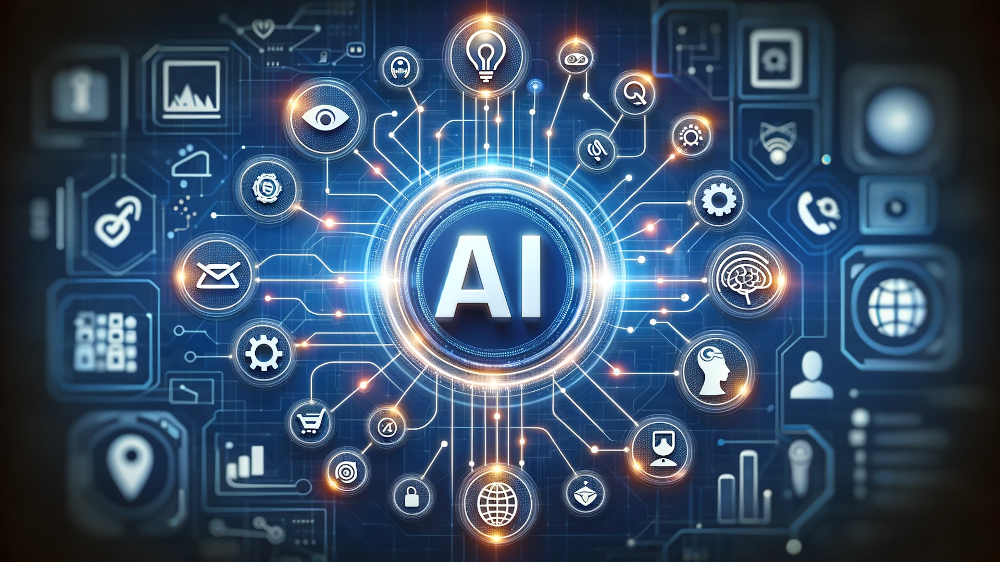

           

<h4>Introduction</h4>

The news that "AI passed the entrance exam for the University of Tokyo, Japan's top university" brought unprecedented public attention to the evolution of AI. Compared to a few years ago, AI has made significant development and can now solve most of the challenges faced during the learning process. This development has sparked debate over whether AI should be integrated into educational environments. The question arises: "Can AI be a good teacher?" In this essay, I will present my opinion from the perspective of a software engineer, reflecting on my use of AI (ChatGPT) in my own learning.

<h4>Personal Experience with AI</h4>

Here are specific examples of how I used ChatGPT to deepen my understanding during ICS 332:

<h6>・Experience WODs </h6>

I asked questions like “What is Prisma, and how does it communicate with the database?” to understand its underlying mechanisms.

<h6>・In-class Practice WODs </h6>

I asked “Why doesn’t this code work?” to deepen my comprehension.

<h6>・In-class WODs </h6>

I asked “Why doesn’t this code work?” to deepen my comprehension.

<h6>・Essays </h6>

I asked “Can you make this sentence more natural English manner?” and used the results to refine my writing.

<h6>・Final Project</h6>

I asked “How can I implement real-time communication?” and “Why doesn’t this code work?” AI was a valuable source of information for solving unfamiliar problems.

<h6>・Learning a concept/tutorial</h6>

I asked questions like “Can you give an example?” or “How is this different from ○○?” to explore the concepts further.

<h6>・Answering questions in class or on Discord</h6>

I valued my own ideas and chose not to use AI.

<h6>・Asking or answering a smart question </h6>

I valued my own ideas and chose not to use AI.

<h6>・Coding example</h6>

I asked “What becomes possible with 'use client'?” to deepen my understanding.

<h6>・Explaining code </h6>

Since this was not directly related to code, I wrote my own explanation.

<h6>・Writing code</h6>

I wrote the documentation myself, as it was not directly related to code.

<h6>・Documenting code</h6>

I wrote the documentation myself, as it was not directly related to code.

<h6>・Experience WODs </h6>

I asked questions like “What is Prisma, and how does it communicate with the database?” to understand its underlying mechanisms.

<h6>・Quality assurance </h6>

I asked “Why is this error happening?” to understand unfamiliar syntax rules.

<h6>・Other uses in ICS 314 not listed </h6>

I often asked “Does this mean ○○?” to solidify my understanding.

In many cases, AI provided critical hints and significantly helped me complete tasks. Even when AI gave incorrect answers, discussing those inconsistencies with it led to deeper insights.

<h4>Impact on Learning and Understanding</h4>

From my personal experience, I believe AI has greatly contributed to my learning. It provided quick and accurate suggestions for my code, helping me organize and refine my thoughts. For me, AI has been an excellent teacher.

<h4>Practical Applications</h4>

In other courses as well, I used AI as an advisor. For example, when developing a university location app using Python and the Google Maps API, I relied heavily on AI to understand how to use the API. At first, I didn’t understand much, but by following AI’s guidance and writing code hands-on, I gradually grasped how each module worked. This demonstrates AI’s usefulness in practical development.

<h4>Challenges and Opportunities</h4>

While AI can provide accurate answers for standard problems, it may struggle with complex or nuanced issues. In such cases, having the knowledge to detect when AI is wrong is crucial. Blindly trusting incorrect AI guidance can hinder learning. Therefore, I believe it’s safest to use AI as a tool for confirmation, based on some prior understanding of the problem. If students maintain discipline, AI can be a valuable partner in deepening their understanding in class.

<h4>Comparative Analysis</h4>

In today’s software education landscape, AI can solve most learning challenges. If students want to avoid learning and take shortcuts, they can. However, compared to the previous era when there was a shortage of teachers, AI makes learning significantly easier. If students can stay disciplined and use AI as a teacher or a source of hints, more talented software engineers will emerge.

<h4>Future Considerations</h4>

AI has made unprecedented progress over the past decades, and some say we may see Artificial General Intelligence (AGI) within the next ten years. When AI surpasses human intelligence, what will the relationship between engineers and AI look like? Code generation will likely be fully automated by AI. Perhaps even workflows and ideas will be generated by AI. In such a future, engineers may leverage their physical presence and specialized knowledge to become facilitators of AI implementation across industries. Their role may evolve into cross-industry consulting on what tasks AI can optimize. At that point, AI and engineering education will be inseparable.

<h4>Conclusion</h4>

As a probabilistic model, AI tends to exclude radically novel or unprecedented ideas. And lacking a physical presence, it is difficult for AI to pioneer new industries. Because of this, the demand for engineers as AI implementation consultants will likely grow. Engineering education should focus on teaching students how to learn effectively from AI and apply that knowledge in real-world settings. Education on how to use AI for learning enhancement may also become essential.

