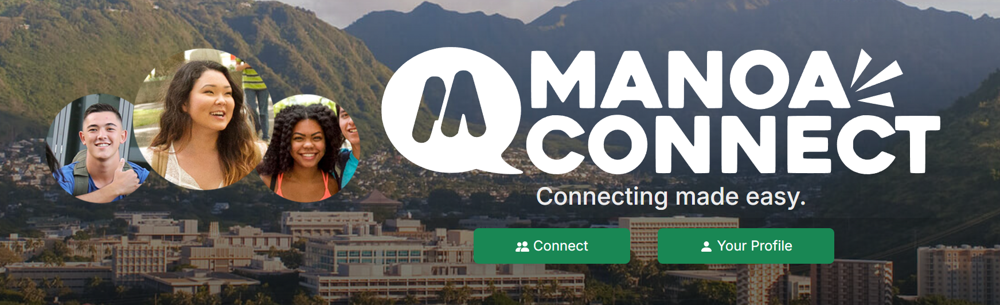

           
<h4>【Overview】</h4>

Our team shared the issue that friendships tended to be concentrated within one’s own academic department. The root cause of this was that most opportunities to interact at school came through classes, and even extracurricular events were typically related to the student’s department. So, the solution we aimed for was to create a “space” where people could engage with a broader range of individuals. The “Manoa Connect” project was launched to enable the formation of cross-departmental friendships through a chat application featuring high-randomness matching.

<h4>【Feature】</h4>

  Manoa Connect includes the following features:
  <ul>
    <li>Homepage</li>
    <li>Profile editing page</li>
    <li>Schedule editing page</li>
    <li>Chat page</li>
    <li>Matching page</li>
  </ul>
URL: <a href = "https://manoa-connect-now.vercel.app/">https://manoa-connect-now.vercel.app/</a>

<h4>【My Role】</h4>

I was in charge of the chat page. Using note functions and state management, I implemented real-time chat functionality.

<h4>【Community Feedback】</h4>

  <ul>
    <li>Some users may not want to share their profiles, so information disclosure should be limited before matching.</li>
    <li>Supporting smartphone usage would make the app more accessible to a wider audience.</li>
  </ul>

<h4>【Developers】</h4>

  <ul>
    <li>Aaron Ramos</li>
    <li>Masaki Sakai</li>
    <li>Chaezen-Lee Pebria</li>
    <li>Codie Nakamura</li>
  </ul>

